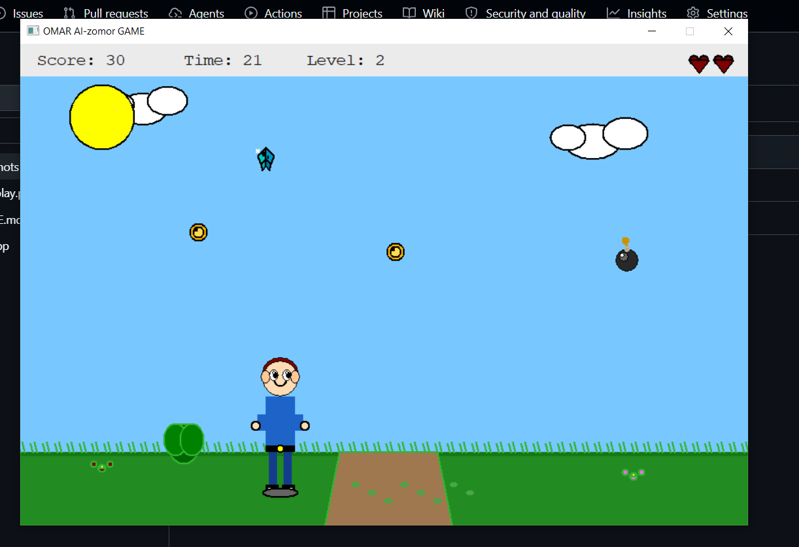

# 🎮 عمر جيم | Omar Game

> لعبة أكشن أركيد بسيطة مكتوبة بلغة C++. اجمع العملات والجواهر، وتجنب القنابل، وحاول البقاء على قيد الحياة لأطول فترة ممكنة!

---

## 🕹️ طريقة اللعب

| المفتاح | الوظيفة |
| :--- | :--- |
| **← →** | تحريك اللاعب يميناً ويساراً |

| العنصر | التأثير |
| :--- | :--- |
| 💰 عملة | **+10** نقاط |
| 💎 جوهرة | **+30** نقاط |
| 💣 قنبلة | **-1** حياة و **-5** ثواني من الوقت |

---

## ⚙️ التشغيل (للمستخدم العادي)

> [!TIP]
> لا تحتاج لتنصيب أي شيء! فقط حمل وشغل.

1. اذهب إلى **[📥 قسم Releases](../../releases)** (اضغط على الرابط على يمين الصفحة).
2. حمل ملف `OmarGame.zip` من أحدث إصدار.
3. فك الضغط وشغل `game.exe`.

---

## 🛠️ البناء من الكود المصدري (للمطورين)

> [!WARNING]
> هذا المشروع يعتمد على مكتبة `graphics.h` (WinBGIm) القديمة. قد تحتاج لبيئة **32-bit** أو Dev-C++ قديم ليعمل بشكل سليم.

1. افتح ملف `game.cpp` في **Dev-C++** أو **Code::Blocks**.
2. تأكد من تفعيل خيارات الرابط التالية في إعدادات المشروع:

-lbgi -lgdi32 -lcomdlg32 -luuid -loleaut32 -lole32

3. اضغط **Build and Run**.

---

## 📸 المعرض

  

---

## 👤 المطور

**عمر الزمر**

